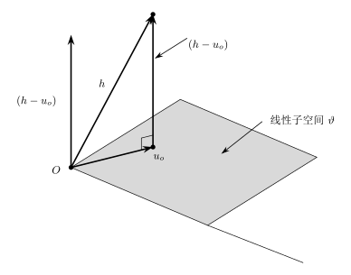

## 零均值随机函数空间

### 定义

设数据 $Z_1,Z_2,\ldots,Z_n$ 来自随机向量 $Z$，它具有一个**底层概率空间** $(\mathcal{Z},\mathcal{A},P)$。这三者分别是样本空间、事件域和概率测度。这里我们暂时不考虑 $P\in\mathcal{P}$，而是认为 $P$ 是该随机向量生成的真实概率测度。

现在考虑函数 $h:\mathcal{Z}\to\mathbb{R}^q$ 是样本空间上的零均值可测函数，即 $h$ 可测且满足
$$
\begin{matrix}
  E(h(Z))=0 \\
  E(h^\top (Z)h(Z))<+\infty
\end{matrix}
$$

::: details 奇怪的记法

这里简单记成 $h(Z)$ 有些令人困惑：作为随机向量的函数，更为我们熟悉的定义应该是 $h:\mathbb{R}^n\to\mathbb{R}^q$，而这里写成了直接定义在样本空间上。

这么写的原因是 $Z$ 不再是初等概率论中的随机向量（是一个 $\Omega\to\mathbb{R}^q$ 的实值可测函数），而是直接和它的实现等价。$\mathcal{Z}$ 本身就是 $Z$ 的定义域。而随机向量 $Z$ 则定义为样本空间到它自身的恒等映射，即
$$
Z(z)=z,\quad z\in\mathcal{Z}
$$
这么定义的动机来源于 $Z$ 本身就是我们的观测，初等概率论中定义的样本空间 $\Omega$ 和样本点 $\omega$ 本质上都是无法观测的，我们很难也没有必要去找到它们。直接把数据的结果定义为样本空间是符合直观且更具普适性的。

相对的，这时候的 $Z$ 本身就无法携带分布的信息。此时其分布诱导的概率测度 $P_Z$ 实际上就是前面提到的底层概率空间的概率测度 $P$，从而改变数据的分布时，我们不需要更改 $Z$ 本身和样本空间，只需要更改概率测度 $P$ 即可。

:::

显然，所有满足上述条件的 $h$ 构成了一个线性空间 $\mathcal{H}$，即对任意的两个 $h_1,h_2\in\mathcal{H}$，它们的线性组合 $ah_1+bh_2\in\mathcal{H}$。

这时候，我们把这些函数视为线性空间中的点。该空间的原点为
$$
h(Z)=0^{q\times 1}
$$

### 维度

$\mathcal{H}$ 的维度和 $h$ 输出的维度 $q$ 无关，而是和 $Z$ 的分布有关。如果 $Z$ 是一个离散型的随机向量，它取值为 $z_1,\ldots,z_k$ 的概率分别为 $\pi_1,\ldots,\pi_k$，则任何一个 $h$ 都可以定义为
$$
h(Z)=\sum_{i=1}^k a_i\mathbb{I}(Z=z_i)
$$
这里可以看出 $h$ 是一个由 $k$ 个线性无关的函数张成的函数类，从而 $\mathcal{H}$ 是一个 $k$ 维线性空间。

如果我们进一步，对 $h$ 施加一些约束，例如前述的零均值，此时
$$
\sum_{i=1}^k a_i\pi_i=0 \implies a_k=-\frac{1}{\pi_k}\sum_{i=1}^{k-1}a_i\pi_i
$$
从而函数空间 $\mathcal{H}$ 变为一个 $k-1$ 维线性空间。

如果 $Z$ 的支撑集（的基数）是无限的（例如 $Z$ 是一个连续性随机向量），那么 $\mathcal{H}$ 就是一个无穷维的线性空间，这是因为连续函数类 $C$ 是可测函数类 $\mathcal{H}$ 的一个子空间，前者无穷维则后者一定也是无穷维的。

## Hillbert 空间

Hillbert 空间是一个定义了内积的 Banach 空间（即完备的赋范线性空间）。在 Hillbert 空间上，我们不仅可以计算距离，还可以通过内积计算夹角和定义正交性。

::: info 内积的定义

对线性向量空间 $\mathcal{H}$，设 $h_1,h_2,h_3\in\mathcal{H}$，定义 $\mathcal{H}$ 上的内积为 $\left \langle \cdot,\cdot \right \rangle: \mathcal{H}^2\to \mathbb{R}^+ $，且满足

1. 正定性：$\left\langle h_1, h_1\right\rangle\ge 0$ 且 $\left\langle h_1, h_1\right\rangle= 0 \Leftrightarrow h_1=0$；
2. 对称性：$\left\langle h_1, h_2\right\rangle=\left\langle h_2, h_1\right\rangle$；
3. 线性性：$\left\langle \lambda h_1+\mu h_2, h_3\right\rangle=\lambda\left\langle h_1, h_3\right\rangle+\mu\left\langle h_2, h_3\right\rangle$.

::: details 半内积

有一些 $\left \langle \cdot,\cdot \right \rangle$ 可能满足条件 2,3 以及 1 的前半条，但存在 $h\neq 0$ 使得 $\left \langle h,h \right \rangle=\|h\|^2=0$，我们称其为半内积。

这一现象在统计中非常常见，因为我们定义的范数和内积很多时候和随机向量的期望相关。但是期望本身是和函数在有限个点内的取值无关，从而存在一些函数，它在某些点处不为零，但期望却为零（$h\overset{a.e.}{=}0$）

在定义了半内积的 Banach 空间中，我们可以通过定义等价类和商空间的办法来构造出 Hillbert 空间。具体来说，我们定义零空间 $\mathcal{N}=\{h\in\mathcal{H}:\left \langle h,h \right \rangle=0\}$，并定义等价关系
$$
h_1\sim h_2\Leftrightarrow h_1-h_2\in\mathcal{N}
$$
现在我们记 $[h]=\{g\in\mathcal{H}:g\sim h\}$ 为代表元是 $h$ 的等价类，重新定义 $\mathcal{H}/\mathcal{N}=\{[h]:h\in\mathcal{H}\}$，并把这些等价类当成新的空间中的点。

这一操作从直观上来看，就是把几乎处处相等的函数视作相同的函数，这在初等概率论中是一个被广泛应用的直觉。

:::

对 $q$ 维具有零均值和有限方差的随机函数 $h_1,h_2$，定义它们之间的内积为
$$
\left \langle h_1,h_2 \right \rangle:=E(h_1^\top h_2)
$$
称其为**协方差内积**。很明显这是一个半内积，我们用前述方法，定义等价类并将其视为新的商空间中的元素，为方便起见，也称这个新的空间为 $\mathcal{H}$。

一旦定义了内积，我们可以定义相应的**范数** $\|h\|=\left \langle h,h \right \rangle^{1/2}$，直观上理解为元素到原点的距离。这实际上就是概率空间上的 $L_2$ 范数。

此外，我们还可以定义**正交**，我们称两个元素 $h_1,h_2$ 正交当且仅当 $\left\langle h_1,h_2\right\rangle=0$。

现在我们知道 $q$ 维具有零均值和有限方差的随机函数构成的空间 $\mathcal{H}$ 上可以定义内积和范数。此外，我们还可以证明其作为赋范线性空间是完备的，即每一个 Cauchy 列都收敛（参见 Lo`eve 1963, p. 161 的 $L_2$ 完备性定理）。如此，$\mathcal{H}$ 是一个 Hillbert 空间。

## Hillbert 空间的线性子空间 & 投影定理

我们有时不会关注整个 Hillbert 空间，而是会关注它的一个线性子空间。$\mathcal{U}\subset\mathcal{H}$ 满足 $u_1,u_2\in\mathcal{U}$ 时 $au_1+bu_2\in\mathcal{U}$，那么它是一个线性子空间。显然，线性子空间一定过原 Hillbert 空间的原点。

对一组 Hillbert 空间中的向量 $h_1,\ldots, h_n$（不妨假设它们线性无关），包含它们的最小线性子空间就是它们张成的空间，其包含了这些向量的所有线性组合，即
$$
\mathrm{span}(h_1,\ldots,h_n)=\left\{\sum_{i=1}^n a_ih_i:a_i\in\mathbb{R},i=1,2,\ldots,n\right\}
$$

::: info 投影定理

设 $\mathcal{H}$ 是 Hillbert 空间，$\mathcal{U}$ 是 $\mathcal{H}$ 的一个闭的线性子空间。对任意的 $h\in\mathcal{H}$，存在唯一的 $u_0\in\mathcal{U}$ 使得其与 $h$ 的距离最近，即
$$
\langle h, u_0\rangle \le \langle h, u\rangle, \forall u\in \mathcal{U}
$$
更进一步地，它们的差 $h-u_0$ 与 $\mathcal{U}$ 正交，即
$$
\langle h-u_0, u\rangle = 0, \forall u\in\mathcal{U}
$$
我们称 $u_0$ 是 $h$ 在 $\mathcal{U}$ 上的投影，记作 $\Pi(h\mid \mathcal{U})$。同时，$u_0$ 也是唯一一个使得 $\langle h-u, u\rangle = 0$ 的向量。

:::

上图展示了投影定理的几何直观。实际上这就是 Euclid 空间上从平面外向平面作垂线在一般 Hillbert 空间上的推广。

同时，在 Hillbert 空间上我们也有勾股定理的推广。

::: info 勾股定理

如果 $h_1,h_2$ 是 Hillbert 空间 $\mathcal{H}$ 的正交元素（即 $\langle h_1, h_2 \rangle=0$），则
$$
\|h_1+h_2\|^2=\|h_1\|^2+\|h_2\|^2.
$$

:::

## 投影定理的简单应用

### 一维随机函数

考虑由均值为零、方差有限的一维随机函数 $h(Z)$ 构成的 Hillbert 空间 $\mathcal{H}$，从而内积表达退化为一维形式：
$$
\langle h_1, h_2 \rangle = E(h_1 h_2)
$$
其中 $h_1(Z), h_2(Z) \in \mathcal{H}$。设 $u_1(Z), \dots, u_k(Z)$ 为该空间中的任意元素，并令 $\mathcal{U}$ 为由 $\{u_1, \dots, u_k\}$ 张成的线性子空间。也就是说，
$$
\mathcal{U} = \{a^T u; \text{ 对于 } a \in \mathbb{R}^k\}
$$
其中，
$$
u^{k \times 1} = (u_1,\ldots,u_k)^\top$$

下面不妨设 $u_1,\ldots,u_k$ 线性无关，从而 $\mathcal{U}$ 是无穷维 Hillbert 空间 $\mathcal{H}$ 的一个 $k$ 维子空间。现在我们任取 $h\in\mathcal{H}$，其在 $\mathcal{U}$ 上的投影可以表示为 $u_1,\ldots,u_k$ 的线性组合 $a_0^\top u=\Pi(h\mid\mathcal{U})$。由投影定理，$h$ 与其投影之差正交于线性子空间 $\mathcal{U}$，即
$$
\left\langle h-a_0^\top u, a^\top u\right\rangle=\sum_{i=1}^k a_i \left\langle h-a_0^\top u,u_j\right\rangle=0,\forall a_j, j=1,\ldots,k.
$$
由内积的定义，我们得到 $E((h-a_0^\top u)u_j)=0$，或者说
$$
E((h-a_0^\top u)u^\top)=0^{(1\times k)}
$$
打开括号得到
$$
E(hu^\top)=a_0^\top E(uu^\top)
$$
如果 $E(uu^\top)$ 可逆，两侧右乘其逆矩阵得到
$$
a_0^\top=E(hu^\top)(E(uu^\top))^{-1}
$$
进而解得投影 $u_0$ 的表达为
$$
u_0 = a_0^\top u = E(hu^\top)(E(uu^\top))^{-1}u
$$
其范数的平方为
$$
\begin{align*}
  E(u_0u_0^\top) & = E(hu^\top)(E(uu^\top))^{-1} E(uu^\top)(E(uu^\top))^{-1}E(uh^\top) \\
  & = E(hu^\top)(E(uu^\top))^{-1}E(uh^\top)
\end{align*}
$$
进而由勾股定理，得到
$$
\|h-a_0^\top u\|=E(h^2)-E(hu^\top)(E(uu^\top))^{-1}E(uh^\top)
$$

这个例子的背景来自多元线性回归。此时 $h$ 是响应变量 $Y$，$u=(u_1,\ldots,u_k)^\top$ 是特征。此时多元回归的最小二乘法正是找到一个线性组合系数 $a_0^\top$ 使得 $Y$ 与 $a_0^\top X$ 的距离最小。从而
$$
a_0^\top = \mathrm{Cov}(X,Y)(\mathrm{Var}(X))^{-1}
$$
这和我们上面推导的结果一致。最后的勾股定理体现的正是残差平方和 $\mathrm{SSE}$ 与回归平方和 $\mathrm{SSR}$ 之和为总平方和 $\mathrm{SST}$。

### q 维随机函数

我们进一步把上面的例子拓展到多响应的多元回归场合。设 $\mathcal{H}$ 是 $q$ 维具有零均值和有限方差的随机函数构成的空间，定义有内积
$$
\langle h_1,h_2 \rangle = E(h_1^\top h_2)
$$
再考虑 $v(Z)$ 是一个 $r$ 维的具有零均值和有限方差的随机函数构成的空间，$\mathcal{U}\subset\mathrm{span}(v(Z))$ 是线性子空间，表示为
$$
\mathcal{U}=\{B^{q\times r}v: B\in\mathbb{R}^{q\times r}\}
$$
不妨设 $v(Z)=(v_1(Z),\ldots,v_r(Z))$ 的所有分量线性无关，则 $\mathcal{U}$ 是一个 $q\times r$ 维的线性子空间，它的基是 $u_{ij}(Z), i=1,\ldots,q; j=1,\ldots,r$ 这 $q\times r$ 个 $q$ 维向量，其中的第 $i$ 个分量为 $v_j(Z)$，而其余分量为 $0$。

现在考虑寻找 $h$ 在 $\mathcal{U}$ 上的投影 $B_0 v$，由于投影的残差和 $\mathcal{U}$ 上的任何向量正交，得到
$$
E((h-B_0v)^\top (Bv))=0,\forall B\in\mathbb{R}^{q\times r}
$$
上面的左式可以逐元素拆分，得到
$$
E((h-B_0v)^\top (Bv))=\sum_i\sum_j B_{ij}E((h-B_0v)_i v_j)=0
$$
我们令 $B$ 是一个特殊的矩阵，它仅在 $(i_0,j_0)$ 处取值为 $1$，其余为 $0$，从而令 $B$ 取遍这样的矩阵，得到
$$
E((h-B_0v)_{i_0} v_{j_0})=0, \forall i_0,j_0
$$
把这样的左式按 $(i_0,j_0)$ 组合成矩阵，直接得到
$$
E((h-B_0v) v^\top)=0^{q\times r}
$$
打开括号，得到
$$
E(hv^\top)=B_0E(vv^\top)
$$
假设 $E(vv^\top)$ 可逆，等式两端右乘其逆矩阵
$$
B_0=E(hv^\top)(E(vv^\top))^{-1}
$$
因此投影 $B_0v$ 的表达为
$$
B_0v = E(hv^\top)(E(vv^\top))^{-1}v
$$
同样，这个结果也和最小化残差平方和的最小二乘法完全等价。

### Cauchy-Schwarz 不等式

Hillbert 空间中成立有 Cauchy-Schwarz 不等式，它也是 Euclid 空间中 Cauchy-Schwarz 不等式的推广，几何直观上度量了向量内积因投影的损失，结果必然小于两者范数的积。

::: info Cauchy-Schwarz 不等式

对任意的 $h_1,h_2\in\mathcal{H}$，有
$$
| \langle h_1,h_2 \rangle |^2 \le \|h_1\|^2\|h_2\|^2
$$
等号成立当且仅当 $h_1$ 和 $h_2$ 线性相关，即 $\exists c\neq 0$ 使得 $h_1=ch_2$

:::
