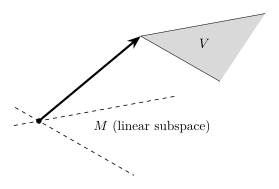

## 一些前置的结论

::: info 向切空间的投影

对任意的一个元素 $h(Z)\in\mathcal{H}$，根据投影定理，存在唯一的一个元素 $a_0(Z)\in\Lambda$ 使得 $\|h-a_0\|$ 最小且满足
$$
\left\langle h-a_0,a \right\rangle =0, \forall a\in\Lambda
$$
我们称 $a_0$ 为 $h$ 在 $\Lambda$ 上的**投影**（Projection），记作 $\Pi(h\mid\Lambda)$，同时称 $h-a_0$ 为 $h$ 投影到 $\Lambda$ 上的**残差**（Residual）。相应地，我们有 $h-a_0=\Pi(h\mid \Lambda^\perp)$。

:::

事实上 [推论 3.1](/src/notes/semiparametric%20statistics/Chap3/Chap3_2.md#corollary1) 的 (2) 等价于 $\mathcal{H}$ 中的元素 $h(Z)$ 与干扰切空间正交。如果我们想要识别所有与干扰切空间正交的元素，我们可以考虑对所有 $h \in \mathcal{H}$ 构造元素集合 $h - \Pi(h|\Lambda)$，由章节 2 给出的[示例](/src/notes/semiparametric%20statistics/Chap2/Chap2.md#q-维随机函数)，投影算子为：
$$
\Pi(h|\Lambda) = E(h S_\eta^T)\{E(S_\eta S_\eta^T)\}^{-1} S_\eta(Z, \theta_0)
$$

同样可以证明，切空间
$$
\mathscr{T} = \{B^{q \times p} S_\theta(Z, \theta_0), \forall B\in\mathbb{R}^{q \times p}\}
$$
可以写成干扰切空间与由感兴趣参数 $\beta$ 的得分向量生成的切空间的直和。也就是说，如果我们定义 $\mathscr{T}_\beta$ 为空间 $\{B^{q \times q} S_\beta(Z, \theta_0), \forall B\in\mathbb{R}^{q \times q}\}$，那么：
$$
\mathscr{T} = \mathscr{T}_\beta \oplus \Lambda
$$

## 维数大于 1 时的渐近方差

在 $\beta$ 的维数为 $1$ 时，比较不同估计量的方差是容易的，我们直接比较数值大小即可。但当其维数大于 $1$ 时，$\mathrm{var}(\hat{\beta})$ 是一个协方差矩阵。这就意味着我们需要更加谨慎地定义这种情况下的什么是“更小的方差”。

对于感兴趣参数 $\beta$ 的两个 RAL 估计量，考虑它们的影响函数分别为 $\varphi^{(1)}(Z)$ 和 $\varphi^{(2)}(Z)$，我们称
$$
\mathrm{var}(\varphi^{(1)}(Z))\le \mathrm{var}(\varphi^{(2)}(Z))
$$
当且仅当对于任意的 $a\in\mathbb{R}^q$，都有
$$
\mathrm{var}(a^\top\varphi^{(1)}(Z))\le \mathrm{var}(a^\top\varphi^{(2)}(Z))
$$
这等价于
$$
a^\top\left[E(\varphi^{(2)}(Z)\varphi^{(2)}(Z)^\top)-E(\varphi^{(1)}(Z)\varphi^{(1)}(Z)^\top)\right]\ge 0
$$
或者说，$E(\varphi^{(2)}(Z)\varphi^{(2)}(Z)^\top)-E(\varphi^{(1)}(Z)\varphi^{(1)}(Z)^\top$ 非负定。

我们知道，当一维随机函数 $a,b$ 正交时，我们可以说明 $\mathrm{var}(a+b)=\mathrm{var}(a)+\mathrm{var}(b)$，但是在它们维度大于 $1$ 的场合下，这个关系不总是生效。下面我们讨论一个对我们讨论方差分解十分有利的特殊情况。

::: info $q$-复制线性空间 (q-replicating linear space)

一个线性子空间 $\mathcal{U} \subset \mathcal{H}$ 被称为 $q$-复制线性空间，如果 $\mathcal{U}$ 具有 $\mathcal{U}^{(1)} \times \dots \times \mathcal{U}^{(1)}$ 或 $\{\mathcal{U}^{(1)}\}^q$ 的形式。

这里 $\mathcal{U}^{(1)}$ 表示 $\mathcal{H}^{(1)}$ 中的一个线性子空间，而 $\{\mathcal{U}^{(1)}\}^q \subset \mathcal{H}$ 表示由元素 $h = (h^{(1)}, \dots, h^{(q)})^T$ 构成的线性子空间，使得对于所有 $j = 1, \dots, q$，都有 $h^{(j)} \in \mathcal{U}^{(1)}$。即，$\{\mathcal{U}^{(1)}\}^q$ 由 $q$ 维随机函数组成，其中向量中的每一个元素都是 $\mathcal{U}^{(1)}$ 的一个元素，或者说空间 $\mathcal{U}^{(1)}$ 自身叠加（堆叠）了 $q$ 次。

:::

由均值为零、方差有限的 $r$ 维随机函数向量 $v^{r \times 1}(Z)$ 张成的线性子空间，即子空间
$$
\mathcal{S} = \{B^{q \times r} v(Z) : \forall B\in\mathbb{R}^{q \times r}\}
$$
就是这样一种子空间。定义 $\mathcal{U}^{(1)}$ 为空间 $\{b^T v(Z) : \forall b\in\mathbb{R}^{r \times 1}\}$，显然 $\mathcal{S} = \{\mathcal{U}^{(1)}\}^q$。由于切空间和干扰切空间是由得分向量张成的线性子空间，因此它们也都是 $q$-复制线性空间。

::: info 多元勾股定理

如果 $h \in \mathcal{H}$ 且是 $q$-复制线性空间 $\mathcal{U}$ 的一个元素，而 $\ell \in \mathcal{H}$ 与 $\mathcal{U}$ 正交，那么：
$$
\text{var}(\ell + h) = \text{var}(\ell) + \text{var}(h),
$$
其中 $\text{var}(h) = E(hh^T)$。进而我们得到了勾股定理的多元版本；即对于任何 $h^* \in \mathcal{H}$，
$$
\text{var}(h^*) = \text{var}(\Pi[h^*|\mathcal{U}]) + \text{var}(h^* - \Pi[h^*|\mathcal{U}]).
$$

::: details 证明

很容易证明，元素 $\ell = (\ell^{(1)}, \dots, \ell^{(q)})^T \in \mathcal{H}$ 与 $\mathcal{U} = \{\mathcal{U}^{(1)}\}^q$ 正交，当且仅当每个元素 $\ell^{(j)}$ 都与 $\mathcal{U}^{(1)}$ 正交（$(j = 1, \dots, q)$）。因此，这样的元素 $\ell$ 不仅在 $E(\ell^T h) = 0$ 的意义上与 $h \in \{\mathcal{U}^{(1)}\}^q$ 正交，而且在 $E(\ell h^T) = E(h \ell^T) = \mathbf{0}^{q \times q}$ 的意义上也正交。从而对于这样的 $\ell$ 和 $h$，我们得到：
$$
\begin{align*}
  \text{var}(\ell + h) & = E[(\ell + h)(\ell + h)^T] \\
  & = E(\ell \ell^T) + E(\ell h^T) + E(h \ell^T) + E(hh^T) = \text{var}(\ell) + \text{var}(h)
\end{align*}
$$
其中 $\text{var}(h) = E(hh^T)$。

:::

多元勾股定理告诉我们，对于 $q$ 维的 $\ell$ 和 $h$，$\ell + h$ 的方差矩阵比 $\ell$ 的方差矩阵或 $h$ 的方差矩阵都要“大”（在上述定义的多元意义上）。

前面我们提到，切空间、干扰切空间以及残差空间都是 $q$-复制线性空间，从而我们现在知道可以立即应用多元勾股定理。根据该定理，任何元素的方差矩阵总是大于投影的方差矩阵，也大于投影后残差的方差矩阵。因此，我们不必再纠结于区分一维随机函数构成的 Hillbert 空间和 $q$ 维随机函数构成的 Hillbert 空间。

## 影响函数在空间中的位置

所有 RAL 对应的影响函数事实上并不构成一个线性子空间。这是因为影响函数需要满足 $E(\varphi S_\beta^\top)=I_{q\times q}$，从而不可能有 $\varphi=0$，这意味着影响函数构成的集合并不通过 Hillbert 空间的原点。

为了进一步描述影响函数在 Hillbert 空间中的位置，我们引入**线性簇**（linear variety）的概念。

::: info 线性簇

**线性簇**是一个线性子空间偏离原点的平移；也就是说，一个线性簇 $V$ 可以写为 $V = x_0 + M$，其中 $x_0 \in \mathcal{H}$ 且 $x_0 \notin M, \|x_0\| \neq 0$，而 $M$ 是一个线性子空间。

:::

::: info 影响函数构成的空间位置

所有影响函数的集合（即满足[定理](/src/notes/semiparametric%20statistics/Chap3/Chap3_2.md#theorem)中 $E(\varphi(Z)S^\top_\theta(z;\theta_0))=\Gamma(\theta_0)$ 的 $\mathcal{H}$ 中的元素）是一个线性簇 $\varphi^*(Z) + \mathscr{T}^\perp$，其中 $\varphi^*(Z)$ 是任意一个影响函数，而 $\mathscr{T}^\perp$ 是垂直于切空间的空间。

::: details 证明

任何元素 $l(Z) \in \mathscr{T}^\perp$ 必须满足：
$$E\{l(Z)S_\theta^T(Z, \theta_0)\} = \mathbf{0}^{q \times p}. \quad (3.33)$$
因此，如果我们取
$$
\varphi(Z) = \varphi^*(Z) + l(Z),
$$
那么
$$
\begin{align*}
E\{\varphi(Z)S_\theta^T(Z, \theta_0)\} &= E[\{\varphi^*(Z) + l(Z)\} S_\theta^T(Z, \theta_0)] \\
&= E[\varphi^*(Z)S_\theta^T(Z, \theta_0)] + E[l(Z)S_\theta^T(Z, \theta_0)] \\
&= \Gamma(\theta_0) + \mathbf{0}^{q \times p} = \Gamma(\theta_0).
\end{align*}
$$
因此，$\varphi(Z)$ 是一个满足定理 3.2 条件 (3.4) 的影响函数。
反之，如果 $\varphi(Z)$ 是一个满足定理 3.2 条件 (3.4) 的影响函数，那么我们可以将其改写为：
$$\varphi(Z) = \varphi^*(Z) + \{\varphi(Z) - \varphi^*(Z)\}.$$
验证 $\{\varphi(Z) - \varphi^*(Z)\} \in \mathscr{T}^\perp$ 是一个简单的练习。

:::
