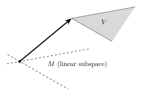

## 一些前置的结论

::: info 向切空间的投影

对任意的一个元素 $h(Z)\in\mathcal{H}$，根据投影定理，存在唯一的一个元素 $a_0(Z)\in\Lambda$ 使得 $\|h-a_0\|$ 最小且满足
$$
\left\langle h-a_0,a \right\rangle =0, \forall a\in\Lambda
$$
我们称 $a_0$ 为 $h$ 在 $\Lambda$ 上的**投影**（Projection），记作 $\Pi(h\mid\Lambda)$，同时称 $h-a_0$ 为 $h$ 投影到 $\Lambda$ 上的**残差**（Residual）. 相应地，我们有 $h-a_0=\Pi(h\mid \Lambda^\perp)$.

:::

事实上 [推论 3.1](/notes/semiparametric%20statistics/Chap3/Chap3_2.md#corollary1) 的 (2) 等价于 $\mathcal{H}$ 中的元素 $h(Z)$ 与干扰切空间正交. 如果我们想要识别所有与干扰切空间正交的元素，我们可以考虑对所有 $h \in \mathcal{H}$ 构造元素集合 $h - \Pi(h|\Lambda)$，由章节 2 给出的[示例](/notes/semiparametric%20statistics/Chap2/Chap2.md#q-维随机函数)，投影算子为：
$$
\Pi(h|\Lambda) = E(h S_\eta^\top)\{E(S_\eta S_\eta^\top)\}^{-1} S_\eta(Z, \theta_0)
$$

同样可以证明，切空间
$$
\mathscr{T} = \{B^{q \times p} S_\theta(Z, \theta_0), \forall B\in\mathbb{R}^{q \times p}\}
$$
可以写成干扰切空间与由感兴趣参数 $\beta$ 的得分向量生成的切空间的直和. 也就是说，如果我们定义 $\mathscr{T}_\beta$ 为空间 $\{B^{q \times q} S_\beta(Z, \theta_0), \forall B\in\mathbb{R}^{q \times q}\}$，那么：
$$
\mathscr{T} = \mathscr{T}_\beta \oplus \Lambda
$$

## 维数大于 1 时的渐近方差

在 $\beta$ 的维数为 $1$ 时，比较不同估计量的方差是容易的，我们直接比较数值大小即可. 但当其维数大于 $1$ 时，$\mathrm{var}(\hat{\beta})$ 是一个协方差矩阵. 这就意味着我们需要更加谨慎地定义这种情况下的什么是“更小的方差”.

对于感兴趣参数 $\beta$ 的两个 RAL 估计量，考虑它们的影响函数分别为 $\varphi^{(1)}(Z)$ 和 $\varphi^{(2)}(Z)$，我们称
$$
\mathrm{var}(\varphi^{(1)}(Z))\le \mathrm{var}(\varphi^{(2)}(Z))
$$
当且仅当对于任意的 $a\in\mathbb{R}^q$，都有
$$
\mathrm{var}(a^\top\varphi^{(1)}(Z))\le \mathrm{var}(a^\top\varphi^{(2)}(Z))
$$
这等价于
$$
a^\top\left[E(\varphi^{(2)}(Z)\varphi^{(2)}(Z)^\top)-E(\varphi^{(1)}(Z)\varphi^{(1)}(Z)^\top)\right]\ge 0
$$
或者说，$E(\varphi^{(2)}(Z)\varphi^{(2)}(Z)^\top)-E(\varphi^{(1)}(Z)\varphi^{(1)}(Z)^\top$ 非负定.

我们知道，当一维随机函数 $a,b$ 正交时，我们可以说明 $\mathrm{var}(a+b)=\mathrm{var}(a)+\mathrm{var}(b)$，但是在它们维度大于 $1$ 的场合下，这个关系不总是生效. 下面我们讨论一个对我们讨论方差分解十分有利的特殊情况.

::: info $q$-复制线性空间 (q-replicating linear space)

一个线性子空间 $\mathcal{U} \subset \mathcal{H}$ 被称为 $q$-复制线性空间，如果 $\mathcal{U}$ 具有 $\mathcal{U}^{(1)} \times \dots \times \mathcal{U}^{(1)}$ 或 $\{\mathcal{U}^{(1)}\}^q$ 的形式.

这里 $\mathcal{U}^{(1)}$ 表示 $\mathcal{H}^{(1)}$ 中的一个线性子空间，而 $\{\mathcal{U}^{(1)}\}^q \subset \mathcal{H}$ 表示由元素 $h = (h^{(1)}, \dots, h^{(q)})^\top$ 构成的线性子空间，使得对于所有 $j = 1, \dots, q$，都有 $h^{(j)} \in \mathcal{U}^{(1)}$. 即，$\{\mathcal{U}^{(1)}\}^q$ 由 $q$ 维随机函数组成，其中向量中的每一个元素都是 $\mathcal{U}^{(1)}$ 的一个元素，或者说空间 $\mathcal{U}^{(1)}$ 自身叠加（堆叠）了 $q$ 次.

:::

由均值为零、方差有限的 $r$ 维随机函数向量 $v^{r \times 1}(Z)$ 张成的线性子空间，即子空间
$$
\mathcal{S} = \{B^{q \times r} v(Z) : \forall B\in\mathbb{R}^{q \times r}\}
$$
就是这样一种子空间. 定义 $\mathcal{U}^{(1)}$ 为空间 $\{b^\top v(Z) : \forall b\in\mathbb{R}^{r \times 1}\}$，显然 $\mathcal{S} = \{\mathcal{U}^{(1)}\}^q$. 由于切空间和干扰切空间是由得分向量张成的线性子空间，因此它们也都是 $q$-复制线性空间.

::: info 多元勾股定理

如果 $h \in \mathcal{H}$ 且是 $q$-复制线性空间 $\mathcal{U}$ 的一个元素，而 $\ell \in \mathcal{H}$ 与 $\mathcal{U}$ 正交，那么：
$$
\text{var}(\ell + h) = \text{var}(\ell) + \text{var}(h),
$$
其中 $\text{var}(h) = E(hh^\top)$. 进而我们得到了勾股定理的多元版本；即对于任何 $h^* \in \mathcal{H}$，
$$
\text{var}(h^*) = \text{var}(\Pi[h^*|\mathcal{U}]) + \text{var}(h^* - \Pi[h^*|\mathcal{U}]).
$$

::: details 证明

很容易证明，元素 $\ell = (\ell^{(1)}, \dots, \ell^{(q)})^\top \in \mathcal{H}$ 与 $\mathcal{U} = \{\mathcal{U}^{(1)}\}^q$ 正交，当且仅当每个元素 $\ell^{(j)}$ 都与 $\mathcal{U}^{(1)}$ 正交（$(j = 1, \dots, q)$）. 因此，这样的元素 $\ell$ 不仅在 $E(\ell^\top h) = 0$ 的意义上与 $h \in \{\mathcal{U}^{(1)}\}^q$ 正交，而且在 $E(\ell h^\top) = E(h \ell^\top) = \mathbf{0}^{q \times q}$ 的意义上也正交. 从而对于这样的 $\ell$ 和 $h$，我们得到：
$$
\begin{align*}
  \text{var}(\ell + h) & = E[(\ell + h)(\ell + h)^\top] \\
  & = E(\ell \ell^\top) + E(\ell h^\top) + E(h \ell^\top) + E(hh^\top) = \text{var}(\ell) + \text{var}(h)
\end{align*}
$$
其中 $\text{var}(h) = E(hh^\top)$.

:::

多元勾股定理告诉我们，对于 $q$ 维的 $\ell$ 和 $h$，$\ell + h$ 的方差矩阵比 $\ell$ 的方差矩阵或 $h$ 的方差矩阵都要“大”（在上述定义的多元意义上）.

前面我们提到，切空间、干扰切空间以及残差空间都是 $q$-复制线性空间，从而我们现在知道可以立即应用多元勾股定理. 根据该定理，任何元素的方差矩阵总是大于投影的方差矩阵，也大于投影后残差的方差矩阵. 因此，我们不必再纠结于区分一维随机函数构成的 Hillbert 空间和 $q$ 维随机函数构成的 Hillbert 空间.

## 影响函数在空间中的位置

所有 RAL 对应的影响函数事实上并不构成一个线性子空间. 这是因为影响函数需要满足 $E(\varphi S_\beta^\top)=I_{q\times q}$，从而不可能有 $\varphi=0$，这意味着影响函数构成的集合并不通过 Hillbert 空间的原点.

为了进一步描述影响函数在 Hillbert 空间中的位置，我们引入**线性簇**（linear variety）的概念.

::: info 线性簇

**线性簇**是一个线性子空间偏离原点的平移；也就是说，一个线性簇 $V$ 可以写为 $V = x_0 + M$，其中 $x_0 \in \mathcal{H}$ 且 $x_0 \notin M, \|x_0\| \neq 0$，而 $M$ 是一个线性子空间.

:::

::: info 影响函数构成的空间位置

所有影响函数的集合（即满足[定理](/notes/semiparametric%20statistics/Chap3/Chap3_2.md#theorem)中所述条件 $E(\varphi(Z)S^\top_\theta(z;\theta_0))=\Gamma(\theta_0)$ 的 $\mathcal{H}$ 中的元素）是一个线性簇 $\varphi^*(Z) + \mathscr{T}^\perp$，其中 $\varphi^*(Z)$ 是任意一个影响函数，而 $\mathscr{T}^\perp$ 是垂直于切空间的空间.

::: details 证明

任何元素 $l(Z) \in \mathscr{T}^\perp$ 必须满足：
$$E\{l(Z)S_\theta^\top(Z, \theta_0)\} = \mathbf{0}^{q \times p}.$$
因此，如果我们取
$$
\varphi(Z) = \varphi^*(Z) + l(Z),
$$
那么
$$
\begin{align*}
E\{\varphi(Z)S_\theta^\top(Z, \theta_0)\} &= E[\{\varphi^*(Z) + l(Z)\} S_\theta^\top(Z, \theta_0)] \\
&= E[\varphi^*(Z)S_\theta^\top(Z, \theta_0)] + E[l(Z)S_\theta^\top(Z, \theta_0)] \\
&= \Gamma(\theta_0) + \mathbf{0}^{q \times p} = \Gamma(\theta_0).
\end{align*}
$$
因此，$\varphi(Z)$ 是一个满足条件的影响函数.

反之，如果 $\varphi(Z)$ 是一个这样的影响函数，那么我们可以将其改写为：
$$
\varphi(Z) = \varphi^*(Z) + \{\varphi(Z) - \varphi^*(Z)\}.
$$
括号内的部分显然垂直于整个切空间，这是由于
$$
E(\varphi(Z) S_\theta^\top(z;\theta_0))=E(\varphi^*(Z) S_\theta^\top(z;\theta_0))=\Gamma(\theta_0)
$$
两式相减立刻得到 $E((\varphi^*(Z)-\varphi(Z)) S_\theta^\top(z;\theta_0))=0$，从而 $(\varphi^*(Z)-\varphi(Z)) \perp \mathscr{\top}$

:::

## 推导有效影响函数

上一节指出，所有正则且渐近线性（RAL）估计量的**影响函数集合**构成了 Hilbert 空间中的一个线性簇 $\tilde{\varphi}(Z) + \mathscr{T}^\perp$（其中 $\tilde{\varphi}$ 为任意一个影响函数，$\mathscr{T}^\perp$ 为切空间的正交补空间）.

在所有可能的 RAL 估计量中，我们自然希望寻找渐近方差矩阵最小的那个估计量. 既然影响函数的方差决定了估计量的渐近方差，寻找最优估计量的问题就转化为了：在这个线性簇中寻找**方差最小的影响函数**，这样的影响函数被称为**有效影响函数**（Efficient Influence Function）.

::: info 有效影响函数

设感兴趣参数为 $\beta(\theta)$，其导数矩阵为 $\Gamma(\theta_0) = \left.\frac{\partial \beta(\theta)}{\partial \theta^\top}\right|_{\theta=\theta_0}$. 若存在一个影响函数 $\varphi_{\mathrm{eff}}(Z)$，使得对任意其他 RAL 估计量的影响函数 $\varphi(Z) \neq \varphi_{\mathrm{eff}}(Z)$，都有
$$
\operatorname{Var}(\varphi(Z)) - \operatorname{Var}(\varphi_{\mathrm{eff}}(Z)) \quad \text{为非零半正定矩阵}
$$
则称 $\varphi_{\mathrm{eff}}(Z)$ 为**有效影响函数**.

有效影响函数唯一存在，且等于**任意一个影响函数向切空间 $\mathscr{T}$ 上的正交投影**：
$$
\varphi_{\mathrm{eff}}(Z) = \Pi\big(\tilde\varphi(Z) \;\big|\; \mathscr{T}\big) = \tilde\varphi(Z) - \Pi\big(\tilde\varphi(Z) \;\big|\; \mathscr{T}^\perp\big)
$$
其中 $\tilde\varphi(Z)$ 为任意满足正则性条件的影响函数. 其显式表达式为：
$$
\varphi_{\mathrm{eff}}(Z) = \Gamma(\theta_0) I^{-1}(\theta_0) S_\theta(Z; \theta_0)
$$
其中 $I(\theta_0) = E[S_\theta(Z;\theta_0)S_\theta^\top(Z;\theta_0)]$ 为 Fisher 信息矩阵.

::: details 证明

首先说明投影的方差最优性。由上一节的线性簇性质，任意一个影响函数 $\varphi(Z)$ 都可以写成固定基准影响函数 $\tilde\varphi(Z)$ 加上某个正交补空间元素 $l(Z) \in \mathscr{T}^\perp$ 的形式：$\varphi = \tilde\varphi + l$.

我们将 $\tilde\varphi$ 正交分解为在切空间 $\mathscr{T}$ 上的投影与在残差空间 $\mathscr{T}^\perp$ 上的投影：
$$
\tilde\varphi = \Pi(\tilde\varphi \mid \mathscr{T}) + \Pi(\tilde\varphi \mid \mathscr{T}^\perp)
$$
于是任意影响函数 $\varphi$ 可改写为：
$$
\varphi = \Pi(\tilde\varphi \mid \mathscr{T}) + \Big[ \Pi(\tilde\varphi \mid \mathscr{T}^\perp) + l \Big]
$$
注意式中第一项属于切空间 $\mathscr{T}$，第二项整体属于正交补空间 $\mathscr{T}^\perp$. 由于 $\mathscr{T}$ 和 $\mathscr{T}^\perp$ 均为 $q$-复制线性空间，由多元勾股定理，两项之间的交叉协方差为零，因此方差矩阵可精确分解为：
$$
\operatorname{Var}(\varphi) = \operatorname{Var}\big(\Pi(\tilde\varphi \mid \mathscr{T})\big) + \operatorname{Var}\Big(\Pi(\tilde\varphi \mid \mathscr{T}^\perp) + l\Big) \ge \operatorname{Var}\big(\Pi(\tilde\varphi \mid \mathscr{T})\big)
$$
由于第二项的协方差矩阵始终半正定，当且仅当其为零向量时取等号（即选取 $l = -\Pi(\tilde\varphi \mid \mathscr{T}^\perp)$），从而说明方差最小的影响函数具有唯一性，且恰好为任意影响函数向切空间 $\mathscr{T}$ 上的投影：
$$
\varphi_{\mathrm{eff}}(Z) = \Pi(\tilde\varphi \mid \mathscr{T}) = \tilde\varphi(Z) - \Pi(\tilde\varphi \mid \mathscr{T}^\perp)
$$

接下来推导有效影响函数的具体形式。由于 $\varphi_{\mathrm{eff}}(Z) \in \mathscr{T}$，根据切空间的定义，它必定可以表示为得分向量的线性组合，即存在某个 $q \times p$ 维常数矩阵 $B_{\mathrm{eff}}$ 使得：
$$
\varphi_{\mathrm{eff}}(Z) = B_{\mathrm{eff}} S_\theta(Z; \theta_0)
$$
另一方面，作为正则估计量的影响函数，$\varphi_{\mathrm{eff}}$ 必须满足正则性必要条件 $E[\varphi_{\mathrm{eff}}(Z) S_\theta^\top(Z;\theta_0)] = \Gamma(\theta_0)$. 将其代入得：
$$
E\big[ B_{\mathrm{eff}} S_\theta(Z;\theta_0) S_\theta^\top(Z;\theta_0) \big] = B_{\mathrm{eff}} I(\theta_0) = \Gamma(\theta_0)
$$
在模型正则（Fisher 信息矩阵可逆）的条件下，立即解得 $B_{\mathrm{eff}} = \Gamma(\theta_0) I^{-1}(\theta_0)$. 从而：
$$
\varphi_{\mathrm{eff}}(Z) = \Gamma(\theta_0) I^{-1}(\theta_0) S_\theta(Z; \theta_0)
$$
证毕. $\square$

:::

从几何意义上看，切空间 $\mathscr{T}$ 是由得分函数张成的空间，包含了所有关于参数 $\theta$ 的局部变异信息；而 $\mathscr{T}^\perp$ 中的分量与得分函数正交，从而不携带任何参数信息。任意 RAL 估计量如果其影响函数在 $\mathscr{T}^\perp$ 上有分量，就会平白增加渐近方差；通过投影滤除这些正交噪声，就得到了方差达到下界的有效影响函数.

---

### 分块参数模型

在半参数统计中，最常见的情形是将参数显式地划分为感兴趣参数 $\beta$（$q$ 维）与干扰参数 $\eta$（$r$ 维），即 $\theta = (\beta^\top, \eta^\top)^\top$. 此时目标参数函数即为坐标投影 $\beta(\theta) = \beta$，其导数矩阵为 $\Gamma(\theta_0) = [I_{q \times q}, \; 0^{q \times r}]$.

为了直接从得分向量中消除干扰参数的影响，我们引入**有效得分**的概念.

::: info 有效得分 (Efficient Score)

在分块参数模型 $\theta = (\beta^\top, \eta^\top)^\top$ 下，**有效得分** $S_{\mathrm{eff}}(Z; \theta_0)$ 定义为感兴趣参数的得分向量 $S_\beta$ 向干扰切空间 $\Lambda$ 作正交投影后的**残差**：
$$
S_{\mathrm{eff}}(Z; \theta_0) = S_\beta(Z; \theta_0) - \Pi\big(S_\beta(Z; \theta_0) \;\big|\; \Lambda\big)
$$
根据向干扰切空间 $\Lambda$ 的投影公式，有效得分可显式写为：
$$
S_{\mathrm{eff}}(Z; \theta_0) = S_\beta(Z; \theta_0) - E\big(S_\beta S_\eta^\top\big)\big\{E\big(S_\eta S_\eta^\top\big)\big\}^{-1} S_\eta(Z; \theta_0)
$$

:::

有效得分的直观统计意义非常清晰：它是从 $S_\beta$ 中减去能够被干扰参数得分 $S_\eta$ 线性预测的部分，保留只与 $\beta$ 变化相关、而与干扰参数 $\eta$ 变动正交的信息.

基于有效得分，我们可以将分块参数下的有效影响函数表示为如下形式：

::: info 分块参数场合

在分块参数模型 $\theta = (\beta^\top, \eta^\top)^\top$ 下：

1. 有效影响函数的形式为：
   $$
   \varphi_{\mathrm{eff}}(Z) = \big\{E\big(S_{\mathrm{eff}} S_{\mathrm{eff}}^\top\big)\big\}^{-1} S_{\mathrm{eff}}(Z; \theta_0)
   $$
2. 有效方差界（即 RAL 估计量所能达到的最小渐近方差矩阵）为有效得分协方差矩阵的逆：
   $$
   \operatorname{Var}(\varphi_{\mathrm{eff}}) = \big\{E\big(S_{\mathrm{eff}} S_{\mathrm{eff}}^\top\big)\big\}^{-1}
   $$

:::

::: details 证明

我们要验证 $\varphi_{\mathrm{eff}}(Z) = \{E(S_{\mathrm{eff}} S_{\mathrm{eff}}^\top)\}^{-1} S_{\mathrm{eff}}(Z; \theta_0)$ 确实是有效影响函数，只需验证它满足 [推论 3.1](/notes/semiparametric%20statistics/Chap3/Chap3_2.md#corollary1) 的两个正则性条件并且落在切空间 $\mathscr{T}$ 内：

1. **与干扰参数得分正交**：根据正交投影的定义，残差 $S_{\mathrm{eff}} = S_\beta - \Pi(S_\beta \mid \Lambda)$ 必然垂直于干扰切空间 $\Lambda$，即满足 $S_{\mathrm{eff}} \perp S_\eta$. 因此：
   $$
   E\big[\varphi_{\mathrm{eff}}(Z) S_\eta^\top(Z;\theta_0)\big] = \{E(S_{\mathrm{eff}} S_{\mathrm{eff}}^\top)\}^{-1} E\big[S_{\mathrm{eff}} S_\eta^\top\big] = 0^{q \times r}
   $$
2. **对感兴趣参数得分的内积归一**：利用分解式 $S_\beta = S_{\mathrm{eff}} + \Pi(S_\beta \mid \Lambda)$，由于 $\Pi(S_\beta \mid \Lambda) \in \Lambda$ 且 $S_{\mathrm{eff}} \perp \Lambda$，有：
   $$
   E\big[S_{\mathrm{eff}} S_\beta^\top\big] = E\Big[ S_{\mathrm{eff}} \big( S_{\mathrm{eff}} + \Pi(S_\beta \mid \Lambda) \big)^\top \Big] = E\big[S_{\mathrm{eff}} S_{\mathrm{eff}}^\top\big] + 0 = E\big[S_{\mathrm{eff}} S_{\mathrm{eff}}^\top\big]
   $$
   因此：
   $$
   E\big[\varphi_{\mathrm{eff}}(Z) S_\beta^\top(Z;\theta_0)\big] = \{E(S_{\mathrm{eff}} S_{\mathrm{eff}}^\top)\}^{-1} E\big[S_{\mathrm{eff}} S_\beta^\top\big] = I_{q \times q}
   $$
3. **属于切空间**：因为 $S_\beta \in \mathscr{T}$ 且 $\Pi(S_\beta \mid \Lambda) \in \Lambda \subset \mathscr{T}$，所以 $S_{\mathrm{eff}} \in \mathscr{T}$，进而 $\varphi_{\mathrm{eff}} \in \mathscr{T}$.

根据正交投影定理在切空间中唯一性的结论，该形式必然就是唯一的有效影响函数.

最后，直接计算其协方差矩阵：
$$
\begin{aligned}
\operatorname{Var}(\varphi_{\mathrm{eff}}) &= E\big[\varphi_{\mathrm{eff}} \varphi_{\mathrm{eff}}^\top\big] \\
&= \{E(S_{\mathrm{eff}} S_{\mathrm{eff}}^\top)\}^{-1} E\big[S_{\mathrm{eff}} S_{\mathrm{eff}}^\top\big] \{E(S_{\mathrm{eff}} S_{\mathrm{eff}}^\top)\}^{-1} \\
&= \{E(S_{\mathrm{eff}} S_{\mathrm{eff}}^\top)\}^{-1}
\end{aligned}
$$
证毕. $\square$

:::

### 与 MLE 的联系

记整个参数 $\theta$ 的 Fisher 信息矩阵分块为：
$$
I(\theta_0) = \begin{bmatrix}
  I_{\beta\beta} & I_{\beta\eta} \\
  I_{\eta\beta} & I_{\eta\eta}
\end{bmatrix} = \begin{bmatrix}
  E(S_\beta S_\beta^\top) & E(S_\beta S_\eta^\top) \\
  E(S_\eta S_\beta^\top) & E(S_\eta S_\eta^\top)
\end{bmatrix}
$$
由于 $S_{\mathrm{eff}} = S_\beta - I_{\beta\eta} I_{\eta\eta}^{-1} S_\eta$，且 $S_{\mathrm{eff}} \perp S_\eta$，直接计算有效得分的方差矩阵可得：
$$
\begin{aligned}
E\big(S_{\mathrm{eff}} S_{\mathrm{eff}}^\top\big) &= E\big[S_{\mathrm{eff}} S_\beta^\top\big] = E\big[(S_\beta - I_{\beta\eta} I_{\eta\eta}^{-1} S_\eta) S_\beta^\top\big] \\
&= I_{\beta\beta} - I_{\beta\eta} I_{\eta\eta}^{-1} I_{\eta\beta}
\end{aligned}
$$
括号中的式子恰好就是 Fisher 信息矩阵中关于子块 $I_{\eta\eta}$ 的 **Schur 补**（Schur Complement）.

因此，最有效 RAL 估计量的渐近方差矩阵为：
$$
\operatorname{Var}(\varphi_{\mathrm{eff}}) = \big( I_{\beta\beta} - I_{\beta\eta} I_{\eta\eta}^{-1} I_{\eta\beta} \big)^{-1}
$$
根据分块矩阵求逆公式，这一结果与对整个 Fisher 信息矩阵求逆后对应的 $\beta$ 子块 $[I^{-1}(\theta_0)]_{\beta\beta}$ 完全一致.

::: tip 极大似然估计量（MLE）达到有效界

在经典的参数模型正则条件下：

1. 若整个模型为全参数模型，$\beta$ 的极大似然估计量 $\hat\beta_{\mathrm{MLE}}$ 满足正则性与渐近线性，其影响函数恰为有效影响函数 $\varphi_{\mathrm{eff}}(Z) = \{E(S_{\mathrm{eff}}S_{\mathrm{eff}}^\top)\}^{-1} S_{\mathrm{eff}}(Z;\theta_0)$.
2. 其渐近方差精确达到了有效方差界 $(I_{\beta\beta} - I_{\beta\eta} I_{\eta\eta}^{-1} I_{\eta\beta})^{-1}$，这说明在所有正则估计量中，MLE 达到了渐近最优性.

:::
